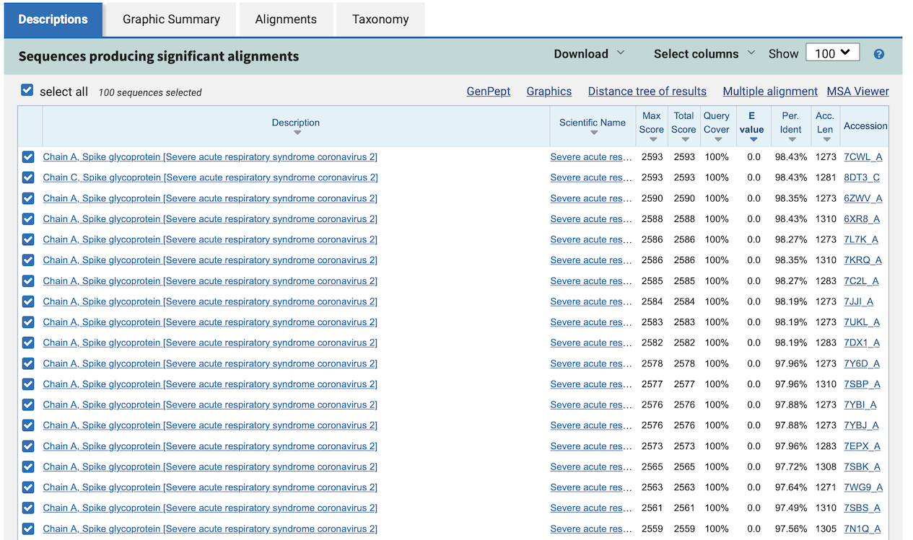

# IPL-workshop: Day 1

## P1: Identify homolog structures wth BLAST

**Aim**

In this exercise, we will use [Protein BLAST](https://blast.ncbi.nlm.nih.gov/Blast.cgi?PROGRAM=blastp&PAGE_TYPE=BlastSearch&LINK_LOC=blasthome) to look in the PDB database for systems with high sequence identity to the target and possibly in complex with antibodies and receptors.

**Tasks**

To complete this exercise, the student needs to:
* paste the target sequence into the box "Enter Query Sequence"
* select the "Protein Data Bank" as database
* run the search
* analyse the results table: system type, sequence identity, coverage, structure resolution
* identify homologs and inspect them visually with [ChimeraX](https://www.cgl.ucsf.edu/chimerax/).

The results table should look like this:



You can also download the hit table and inspect the results using the python notebook ```analyze_BLAST.ipynb```. 

## P2: Sequence alignment with MAFFT

**Aim**

In this exercise, we will use [MAFFT](https://mafft.cbrc.jp/alignment/server/index.html) to do a sequence alignment between the homolog(s) identified in the previous exercise and the target sequence.

**Tasks**

To complete this exercise, the student needs to:

* retrieve the sequence of the homolog identified in the previous exercise with BLAST. 
  The sequence should be extracted from the PDB file using the ```get_fasta_PDB.py``` script as follows:
  ```
  python get_fasta_PDB.py 7cwl.pdb 
  ```
  This script will create two files:
  1. ```7cwl.fasta```: sequence extracted from the PDB, one per chain. Non-protein atoms have been removed
  2. ```7cwl-protein.pdb```: PDB file containing only protein residues matching the sequence file ```7cwl.fasta``` 

* paste the sequence of the correct chain (ignore sequences of antibodies/receptors present in the homolog PDB) along with the target sequence in the "Input" box
* run the alignment with default parameters
* inspect the results
* download the alignment file (Fasta format) to be used in the next exercises

## P3: Build homology models of viral protein in complex with receptor/antibody

**Aim**

In this exercise, we will use [MODELLER](https://salilab.org/modeller/) to build an homology model of our viral protein in complex with antibodies/receptors using the template(s) identified in the previous exercises.

**Tasks**

To complete this exercise, the student needs to:

* first prepare the template PDB file by extracting the desidered chains from the PDB of the homolog structure.
  In this example, we will use ```7cwl.pdb``` and extract chain C (spike) and chains I and K (Fab P17 heavy and light chains). We can do this with a text editor or using
  the followng python script:
  
  ```
  python extract_chains.py 7cwl-protein.pdb C I K 

  ```
  The script will generate ```template.pdb``` with only the desired chains.

* prepare an alignment file in MODELLER (pir) format with the sequences of the chains to model. This file is constructed from the alignment obtained with MAFFT with a few modifications:
  1. The sequence of the template should start with the following header:
  ```
  >P1;template
  structureX:template:FIRST:C:LAST::template::-1.00:-1.00
  ```
  2. The target sequence should start with the following header:
  ```
  >P1;BANAL-20-52
  sequence:BANAL-20-52:1::LAST:::::
  ```
  Chains are separated by the symbol ```/``` and the last chain should be terminated with ```*```.
  We name this file ```alignment.pir```.

* prepare the MODELLER python script, called ```build_model.py```. This script specifies:
  1. the name of the template ```knowns='template'```
  2. the name of the target sequence ```sequence='BANAL-20-52'```
  3. the directory where the template PDB can be found
  4. the scoring functions used to evaluate the model quality
  5. the number of homology models to build (min 5, max 100)

* run MODELLER. This can be simply done with:
  ```
  python build_model.py
  ```

* assess the quality of the homology models generated by MODELLER 
