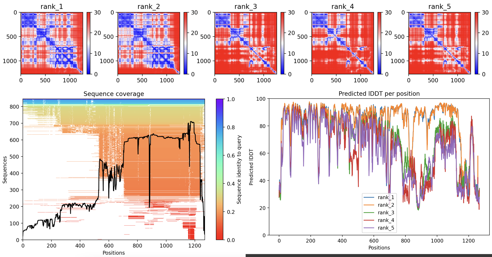
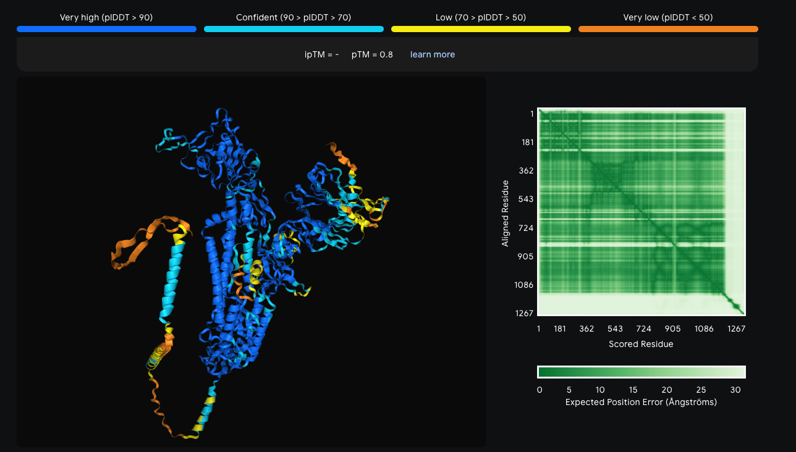
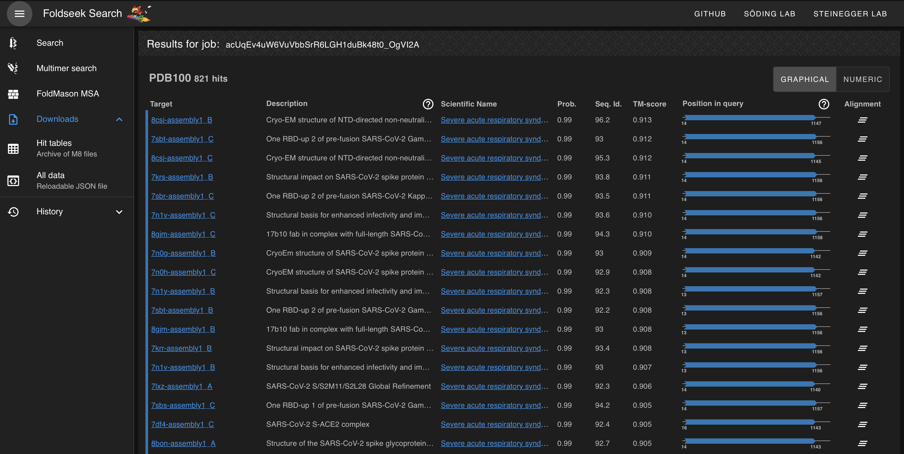

# IPL-workshop: Day 2

## P5: Building models of viral proteins with AF2/AF3

**Aim**

In this exercise, we will use both [AF2](https://colab.research.google.com/github/sokrypton/ColabFold/blob/main/AlphaFold2.ipynb) and [AF3](https://alphafoldserver.com/about) to generate structural models of the viral protein directly from sequence and analyze the quality of the models.

**Tasks**

To complete this exercise:
* we will start using the ColabFold v1.5.5 implementation of AF2 to generate structural models.
  The students might want to play with the following parameters:
  1. ```template_mode```: to avoid using templates (```none```) or to use detected templates in pdb100 (```pdb100```)
  2. ```num_recycles```: to change the number of recycles (try varying from 1 to 3)
  3. the sampling parameters: ```max_msa```, ```num_seeds```, and ```use_dropout``` 

* The quality of the models (Predicted aligned error, or PAE, MSA coverage, and pLDDT) can be assessed directly online by inspecting the plots reported. 

  

  We will download the PDB of the models for visualization with ChimeraX and analysis with Python notebook (see below)

* we will then use AF3, which does not provide the same options as the ColabFold implementation of AF2. With AF3, we will inspect the model quality online and download a zip file with all the results for further analysis.

  

* now that we have generated a number of models with AF2 and AF3, we will perform additional analysis on our local hardware.
  1. we start with visual inspection. You can open all the models with ChimeraX, align then with "Tools/Structure Analysis/Matchmaker" and color them by Bfactors. We can use the AlphaFold classic palette, by typing ```color bfactor palette alphafold``` in ChimeraX command line. 

  2. now we will analyse the per-residue pLDDT across all models generated with AF2 and AF3. To do so, we have prepared a Python Notebook:

     ```
     jupyter lab analyze_AF.ipynb
     ```

  3. based on the quality assessment above, we will identify the most reliable model(s) to be used in the next exercise 

## P6: Look for similar structures in complex with antibodies/receptors

**Aim**

In this exercise, we will use [Foldseek](https://search.foldseek.com/search) to identify proteins structurally similar to the AF2/AF3 of the viral spike and possibly in complex with antibodies/receptors. Sometimes such proteins have low sequence identity with the target protein and therefore cannot be identified with a sequence similarity search with BLAST.

**Tasks**

To complete this exercise, the student will:
* select one or more AF2/AF3 models obtained in the previous exercise
* upload the PDB of the model on Foldseek. For AF3 models, please make sure to use the PDB file and not the CIF
* select the ```PDB100``` database
* try with two different similarity metrics: ```3Di/AA``` and ```TM-align```
* inspect the table of results, in particular look for systems in complex with antibodies/receptors with high similarity, as measured by TM-score or RMSD.  

  

* the table can be inspected online or downloaded as json file (```Downloads/All data```). In the latter case, the following Python
  Notebook can be used to filter the entries using different criteria:
  ```
  jupyter lab analyze_Foldseek.ipynb
  ```

## P7: Building models of protein complexes with AF3
 
**Aim**

In this exercise, we will use [AF3](https://alphafoldserver.com/about) to build structural models of our viral protein in complex with antibodies/receptors. 

**Tasks**

To complete this exercise, the student will:
* identify antibodies/receptors that could potentially bind the viral protein. The students can use the information obtained in previous exercises:
  1. BLAST: potential partners discovered with a sequence similarity search
  2. Foldseek: potential partners discovered with a structure similiarity search

* as an example, we will build a protein complex of the viral protein in complex with the Fab P17 (BLAST) and XXX (Foldseek)

* we will retrieve the FASTA sequences of the partners directly from the [PDB](https://www.rcsb.org) by downloading them from the entries of the homologues identified with BLAST and Foldseek, for example [7cwl](https://www.rcsb.org/structure/7cwl), chains I and K

* on the AF3 webpage, the students will input one sequence per each component of the protein complex and submit the job. The students are invited to model multiple protein complexes using different antibodies/receptors, within the limit of the number of jobs allowed per day

## P8: Quality assessment with different scoring functions

**Aim**

In this exercise, we will

**Tasks**

## P9: Structural analysis with MDAnalysis

**Aim**

In this exercise, we will

**Tasks**
